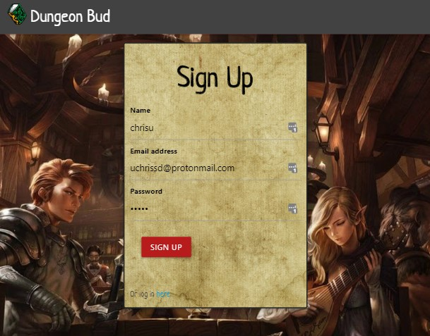
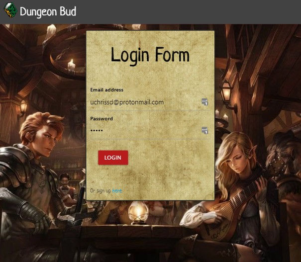
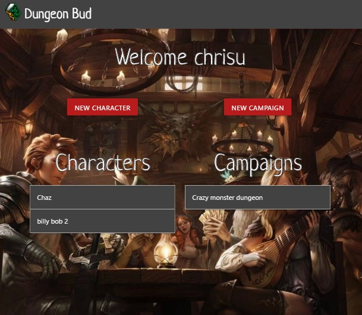
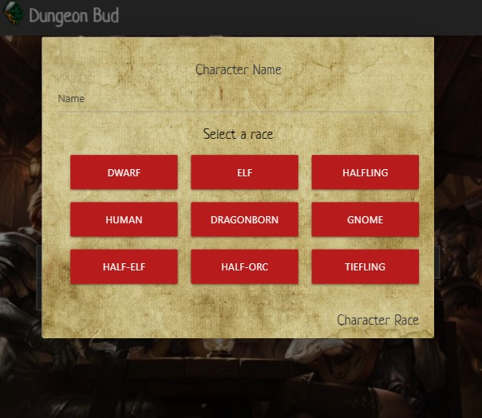
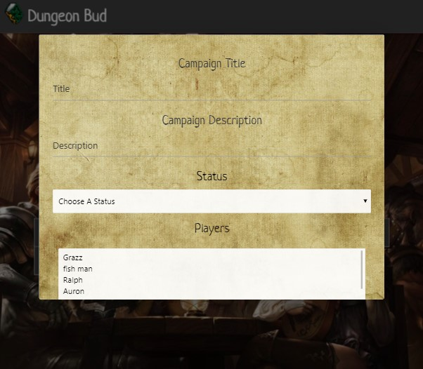

# Dungeon Bud

**Description**

Dungeon Bud is a web application that allows Dungeons & Dragons players to save characters and campaigns to a database. The goal of the application is to help players save their campaign and character information to a database. Users have unique profiles where they can add, edit or delete the campaigns and characters that they have added to the database. They can also add their characters to other player’s campaigns or add other player's characters to the campaigns they have created.

One thing our team noticed when developing this app is that there are no official, robust API’s for the Dungeons & Dragons game. If we were to scale this project up, taking on the task of building that API would be a goal of our team. It would allow for a more thorough campaign and character creation process.

**User Story**

Given that I am someone who plays Dungeons & Dragons regularily, I want to be able to store information about my characters and the campaigns I have created or am involved with in an online application.

**Build status**

The build status is complete.

**Code style**

Dungeon Bud is written in JavaScript. The back end of the application functions within the Node.js framework. We are using a MySql database with three tables: characters, campaigns and users. We used the Node.js Sequelize library to generate these tables.

Our application relies on the Node.js Express server library to handle our server and routing.

The front-end of the application uses jQuery for handling any dynamic HTML rendering via JavaScript as well as our API calls to the Dungeons & Dragons API for class and race information.

Our team used the Google Materialize library to design our grid system and some of the application’s styling, like buttons, drop-downs and modals. We also used customs CSS styling for other parts of the application, like fonts, logo and backgrounds.

**Screenshots**







**Code Example**

```javascript
//Create new character
$("form.character").on("submit", function(event) {
  event.preventDefault();
  // Wont submit the character if we are missing a body or a title
  if (!nameInput.val().trim()) {
    return;
  }
  console.log(data.id);
  // Constructing a newPost object to hand to the database
  var newCharacter = {
    name: nameInput.val().trim(),
    race: raceSelect.val().trim(),
    class: classSelect.val().trim(),
    level: levelInput.val().trim(),
    bio: bioInput.val().trim(),
    userId: data.id
  };
  console.log(updatingChar);

  //determine if we're updating the character or adding a new one
  if (updatingChar) {
    updateCharacter(newCharacter, characterId);
    updatingChar = false;
  } else {
    submitCharacter(newCharacter);
  }
  //call method to send character info to database

  // Submits a new character and brings user to main page upon completion
  function submitCharacter(newCharacter) {
    console.log(newCharacter);
    $.ajax({
      method: "POST",
      url: "/api/character",
      data: newCharacter
    }).then(function() {
      window.location.href = "/main";
    });
  }
});
```

**Installation**

No installation necessary. Project is hosted here: https://dungeon-bud.herokuapp.com/

**Future development**

Our team identified several opportunities for further developing Dungeon Bud. These would include additional database tables to create more associations between users, developing our own Dungeons & Dragons API, a more robust character creation process, and the ability to build characters based on which version of the game you are using.

**Credits**

API used: https://www.dnd5eapi.co/ (for Dungeons & Dragons 5th Edition)
Libraries: Materialize CSS by Google
Developers: Courtney Tucker (Github: Ctucker9233), Brendan Berry (Github: berrybrendan), Christopher Underwood (Github: uchrissd), Blake Fogle (Github: foglebd)
